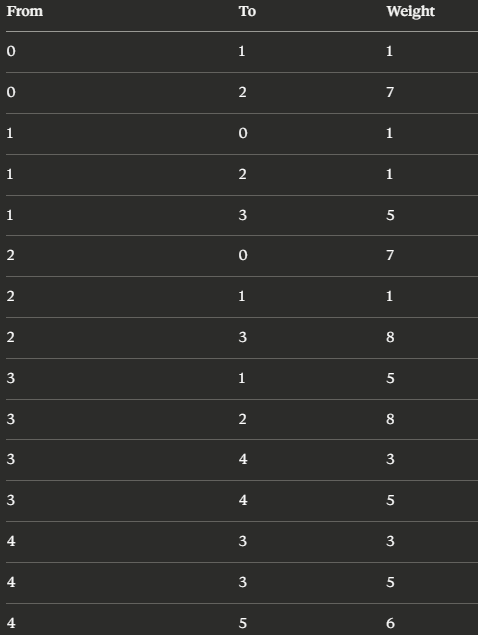

Assignment 4: Graph Traversal and Representation System
===============================================
A. Project Overview
=====================
At its core, a graph is a data structure composed of vertices (nodes) linked together by edges (connections). For this project, I successfully implemented a custom graph structure utilizing an adjacency list approach, alongside two fundamental traversal algorithms: Breadth-First Search (BFS) and Depth-First Search (DFS).

B. Class Descriptions
=====================
Vertex.java: Represents an individual node within the graph and stores a unique integer id.

Edge.java: Defines the connection between two nodes, tracking both the source and destination vertices.

Graph.java: The primary class responsible for building the graph. It uses an adjacency list where each vertex maps directly to a list of its connected neighbors (e.g., Vertex(0) -> [Vertex(1), Vertex(2)]). This provides an optimal space complexity of O(V + E). Key methods include addVertex(), addEdge(), printGraph(), bfs(), and dfs().

Experiment.java: Dedicated to performance testing. It manages the execution and timing of the algorithms via methods like runTraversals(), runMultipleTests(), and printResults().

C. Algorithm Descriptions
=========================
Breadth-First Search (BFS)
BFS relies on a Queue data structure to explore the graph systematically, level by level.

Mark the starting vertex as visited and push it into the queue.

Dequeue the vertex at the front, print it, and enqueue all of its unvisited neighbors.

Repeat the process until the queue is completely empty.

Time Complexity: O(V + E).

Primary Use Case: Finding the shortest path in unweighted networks.

Depth-First Search (DFS)
DFS utilizes recursion to dive as deeply as possible along a single branch before backtracking.

Mark the current vertex as visited and print it.

Recursively call the function on each unvisited neighbor.

Backtrack once a path reaches a dead end (no unvisited neighbors remaining).

Time Complexity: O(V + E).

Primary Use Case: Cycle detection and maze-solving algorithms.

Limitations: It does not guarantee finding the shortest path and risks stack overflow errors when processing exceptionally deep graphs.

D. Experimental Results
=======================
Graph Size	BFS Time (ns)	DFS Time (ns)
10 vertices		71000          59800
30 vertices		272400         324400
100 vertices	6128	       459000
Observations:
* Execution times naturally increase as the graph expands, which accurately reflects the expected O(V + E) time complexity.
* In most of these experiments (10 and 100 vertices), DFS proved to be faster. However, BFS was faster for the 30-vertex graph. The general efficiency of DFS in these tests is likely because the overhead of recursive calls is often lower than the constant queue management required by BFS.
* The structural layout of the branches explicitly dictates the traversal sequences, resulting in clearly distinct output orders for BFS and DFS.

E. Screenshots
==============
Graph Structure

BFS Output

DFS Output

Performance Results

F. Reflection
Working through this assignment significantly deepened my practical understanding of graph data structures. The most challenging yet rewarding part was analyzing exactly why BFS and DFS generate such different traversal paths—watching BFS expand outward uniformly while DFS aggressively pursues a single route to its end. Additionally, I gained a strong appreciation for the memory efficiency of adjacency lists, which only store actual edge connections rather than empty spaces. Finally, it was insightful to see firsthand that despite their vastly different exploration strategies, both algorithms ultimately operate with the same O(V + E) complexity limit.

BONUS TASK 
=============

Graph Algorithms — Java Implementation
This project implements a weighted undirected graph in Java, supporting Breadth-First Search (BFS), Depth-First Search (DFS), and Dijkstra's Shortest Path algorithm. The graph is backed by an adjacency list and designed to scale across small, medium, and large vertex sets.
---
Bonus Task: Dijkstra's Algorithm
This extension introduces edge weights to the graph infrastructure and implements Dijkstra's algorithm to compute single-source shortest paths.
----
Architectural Changes
To support weighted graphs without breaking backwards compatibility, the existing codebase was refactored as follows:

Edge Class: Upgraded to support a weight field.

Added constructor: Edge(Vertex source, Vertex destination, int weight).
Retained the original Edge(source, destination) constructor, which forwards to the new one with a default weight = 1.

Graph Class: Internal storage transitioned from an adjacency list of IDs (Map<Integer, List<Integer>>) to full edge objects (Map<Integer, List<Edge>>).

addEdge(from, to) remains functional and defaults to a weight of 1.
Added an overloaded addEdge(from, to, weight) method for explicit edge weighting. As the graph is undirected, symmetric Edge instances are added to both adjacency lists.
Legacy Traversal Preservation: Both BFS and DFS remain fully functional without logic changes — they now iterate over Edge objects and call edge.getDest() instead of accessing vertices directly.

------
Dijkstra Implementation Details

Method Signature: void dijkstra(int start)
Constraints & Assumptions: Vertex IDs are strictly bounded from 0 to n − 1, allowing direct mapping to array indices.

Execution Flow
Instead of using a priority queue (min-heap), the algorithm relies on array-based tracking to fit simple loop structures:

Initialize a dist[] array of size n filled with Integer.MAX_VALUE, setting dist[start] = 0.
Initialize a boolean visited[] array of size n to false.
Loop n times:

Scan: Find the unvisited vertex u with the minimum value in dist[]. If no reachable, unvisited vertex remains, break early.
Visit: Mark u as visited.
Relax: For every outgoing edge from u to neighbor v, if dist[u] + weight < dist[v], update dist[v] = dist[u] + weight.

Print the finalized shortest-path distances.

Complexity Note: By choosing a linear scan over a Min-Heap/Priority Queue, the time complexity scales at O(V²) rather than O((V + E)logV). While sub-optimal for large graphs, this approach eliminates heap allocation overhead and runs highly efficiently for small vertex sets.

-----

Weighted Graph Layout
The implementation was validated using the following graph structure (small graph, 10 vertices):

----

Data Structures Used

int[] dist  - Stores shortest known distance from start to each vertex; initialised to Integer.MAX_VALUE
boolean[] visited- Tracks which vertices have been permanently finalised
Map<Integer, List<Edge>> - Adjacency list storing weighted edge objects per vertex

----

Project Structure 

Vertix.java - Represents a graph vertex with an integer ID 

Edge.java - Represents a weighted undirected edge between two vertices

Graph.java - Graph structure using adjacency list; supports BFS, DFS, Dijkstra

Experiment.java - Runs and measures traversal performance across graph sizes

Main.java - Entry point — builds small/medium/large graphs and runs all algorithms