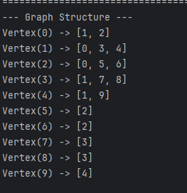
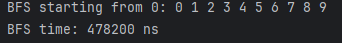
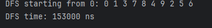
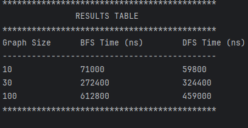

Assignment 4: Graph Traversal and Representation System
===============================================
A. Project Overview
=====================
At its core, a graph is a data structure composed of vertices (nodes) linked together by edges (connections). For this project, I successfully implemented a custom graph structure utilizing an adjacency list approach, alongside two fundamental traversal algorithms: Breadth-First Search (BFS) and Depth-First Search (DFS).

B. Class Descriptions
=====================
Vertex.java: Represents an individual node within the graph and stores a unique integer id.

Edge.java: Defines the connection between two nodes, tracking both the source and destination vertices.

Graph.java: The primary class responsible for building the graph. It uses an adjacency list where each vertex maps directly to a list of its connected neighbors (e.g., Vertex(0) -> [Vertex(1), Vertex(2)]). This provides an optimal space complexity of O(V + E). Key methods include addVertex(), addEdge(), printGraph(), bfs(), and dfs().

Experiment.java: Dedicated to performance testing. It manages the execution and timing of the algorithms via methods like runTraversals(), runMultipleTests(), and printResults().

C. Algorithm Descriptions
=========================
Breadth-First Search (BFS)
BFS relies on a Queue data structure to explore the graph systematically, level by level.

Mark the starting vertex as visited and push it into the queue.

Dequeue the vertex at the front, print it, and enqueue all of its unvisited neighbors.

Repeat the process until the queue is completely empty.

Time Complexity: O(V + E).

Primary Use Case: Finding the shortest path in unweighted networks.

Depth-First Search (DFS)
DFS utilizes recursion to dive as deeply as possible along a single branch before backtracking.

Mark the current vertex as visited and print it.

Recursively call the function on each unvisited neighbor.

Backtrack once a path reaches a dead end (no unvisited neighbors remaining).

Time Complexity: O(V + E).

Primary Use Case: Cycle detection and maze-solving algorithms.

Limitations: It does not guarantee finding the shortest path and risks stack overflow errors when processing exceptionally deep graphs.

D. Experimental Results
=======================
Graph Size	BFS Time (ns)	DFS Time (ns)
10 vertices		71000          59800
30 vertices		272400         324400
100 vertices	6128	       459000
Observations:
* Execution times naturally increase as the graph expands, which accurately reflects the expected O(V + E) time complexity.
* In most of these experiments (10 and 100 vertices), DFS proved to be faster. However, BFS was faster for the 30-vertex graph. The general efficiency of DFS in these tests is likely because the overhead of recursive calls is often lower than the constant queue management required by BFS.
* The structural layout of the branches explicitly dictates the traversal sequences, resulting in clearly distinct output orders for BFS and DFS.

E. Screenshots
==============
Graph Structure

BFS Output

DFS Output

Performance Results

F. Reflection
Working through this assignment significantly deepened my practical understanding of graph data structures. The most challenging yet rewarding part was analyzing exactly why BFS and DFS generate such different traversal paths—watching BFS expand outward uniformly while DFS aggressively pursues a single route to its end. Additionally, I gained a strong appreciation for the memory efficiency of adjacency lists, which only store actual edge connections rather than empty spaces. Finally, it was insightful to see firsthand that despite their vastly different exploration strategies, both algorithms ultimately operate with the same O(V + E) complexity limit.